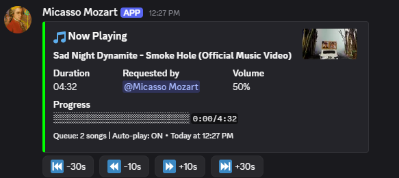
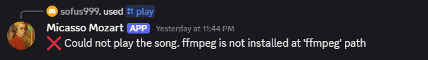

# Discord Music Bot

A complete Discord music bot built with Discord.js v14, DisTube, and yt-dlp integration. Features YouTube Premium support, rich embeds, comprehensive queue management, and can run as a Windows service for 24/7 operation.

## 🎵 Features

- **Music Streaming**: Support for YouTube, SoundCloud, and Spotify
- **YouTube Premium**: Ad-free experience with cookie authentication
- **Slash Commands**: Modern Discord slash command interface with 20+ commands
- **Auto-play**: Rythm-like auto-play functionality for continuous music
- **Advanced Queue Management**: Add, skip, shuffle, jump, remove, and clear queue
- **Interactive Search**: Search with dropdown selection
- **Playlist Support**: Load entire YouTube playlists and radio mixes
- **Rich Embeds**: Beautiful, informative messages with progress bars
- **Seek Controls**: Skip forward/backward in songs with interactive buttons
- **Voice Channel Integration**: Automatic voice channel joining/leaving
- **Windows Service**: Run as a Windows service for 24/7 operation
- **Professional Logging**: Daily rotating logs with error tracking
- **Error Handling**: Comprehensive error handling and user feedback

## 🚀 Quick Start

### Prerequisites

- Node.js 16.9.0 or higher
- A Discord bot token
- YouTube Premium account (optional, for ad-free experience)

### Installation

1. **Clone or download this repository**
   ```bash
   git clone https://github.com/yourusername/discord-music-bot.git
   cd discord-music-bot
   ```

2. **Install dependencies**
   ```bash
   npm install
   ```

   **⚠️ IMPORTANT:** After `npm install`, you MUST rebuild native modules:
   ```bash
   npm rebuild
   ```
   
   This is critical because:
   - Native modules (ffmpeg-static, sodium-native, @discordjs/opus) are platform-specific
   - If you copy files from another PC, they need to be rebuilt for your current machine
   - Skipping this step will cause FFMPEG and voice connection errors

3. **Set up environment variables**
   - Create a `.env` file in the project root
   - Add your Discord bot token:
   ```env
   DISCORD_TOKEN=your_bot_token_here
   ```
   
   **Get your Discord bot token:**
   - Go to [Discord Developer Portal](https://discord.com/developers/applications)
   - Create a new application or select existing one
   - Go to "Bot" section → Copy the token
   - Paste into `.env` file

4. **Test the bot**
   ```bash
   npm start
   ```
   
   You should see:
   ```
   🎵 Music Bot is ready!
      Logged in as: YourBotName#1234
      Bot ID: 1234567890
      Servers: 1
      yt-dlp: Installed at node_modules/@distube/yt-dlp/bin/yt-dlp.exe
      FFmpeg: C:\path\to\node_modules\ffmpeg-static\ffmpeg.exe
   ✅ Slash commands registered successfully!
   ```

5. **Configure YouTube Premium (Optional)**
   - See [YouTube Premium Setup](#youtube-premium-setup) section below

### ⚠️ First Time Setup on New PC - Important!

If you're cloning this repository on a new PC or moving it from another computer, follow these steps to avoid common errors:

#### Step 1: Clean Install Dependencies
```bash
# Remove node_modules if they were copied from another PC
rmdir /s /q node_modules  # Windows
rm -rf node_modules        # Linux/Mac

# Fresh install
npm install

# Rebuild native modules for your platform (CRITICAL!)
npm rebuild
```

#### Step 2: Verify FFMPEG Installation
```bash
# Run diagnostics
npm run test-service
```

Look for:
- ✅ ffmpeg-static installed
- ✅ Path to ffmpeg.exe shown
- ✅ Exists: YES

#### Step 3: Test Before Running as Service
```bash
# Always test with npm start first
npm start
```

Join a voice channel and try `/play [song]`. If music plays, you're good to go!

#### Step 4: Kill Any Existing Processes
Before running as service, make sure no other instances are running:
```powershell
# Kill all node processes
taskkill /F /IM node.exe
```

### 🎵 Bot Working Successfully

When everything is configured correctly, you'll see:



Features shown:
- ✅ Auto-play enabled
- ✅ Song playing with progress bar
- ✅ Interactive seek buttons (-30s, -10s, +10s, +30s)
- ✅ Queue showing next song
- ✅ Volume and duration displayed

### ❌ Common Error After Cloning

If you forget to rebuild native modules, you'll see this error:



**Fix:** Run `npm rebuild` and restart the bot

## 🤖 Discord Bot Setup

1. **Create a Discord Application**
   - Go to [Discord Developer Portal](https://discord.com/developers/applications)
   - Click "New Application" and give it a name
   - Go to the "Bot" section
   - Click "Add Bot"
   - Copy the bot token and add it to your `.env` file

2. **Set Bot Permissions**
   - Go to OAuth2 > URL Generator
   - Select scopes: `bot`, `applications.commands`
   - Select bot permissions:
     - Send Messages
     - Use Slash Commands
     - Connect
     - Speak
     - Use Voice Activity
   - Copy the generated URL and invite the bot to your server

3. **Required Intents**
   - The bot automatically requests the necessary intents
   - If you encounter issues, ensure these intents are enabled in your Discord application:
     - Server Members Intent
     - Message Content Intent

## 🍪 YouTube Premium Setup

To use YouTube Premium features (ad-free experience), you need to export your browser cookies:

### Method 1: Using Browser Extension (Recommended)

1. **Install a cookies extension**
   - Chrome: [cookies.txt](https://chrome.google.com/webstore/detail/cookies-txt/njabckikapfpffapmjgojcnbfjonfjfg)
   - Firefox: [cookies.txt](https://addons.mozilla.org/en-US/firefox/addon/cookies-txt/)

2. **Export cookies**
   - Download Chrome Extension [Get Cookies.txt LOCALLY](https://chromewebstore.google.com/detail/get-cookiestxt-locally/cclelndahbckbenkjhflpdbgdldlbecc)
   - Go to [YouTube](https://youtube.com)
   - Make sure you're logged in with your Premium account
   - Click the extension icon
   - Select "Export cookies for this site"
   - Save as `youtube-cookies.txt` in your bot directory

### Method 2: Manual Cookie Export

1. **Open browser developer tools** (F12)
2. **Go to Application/Storage tab**
3. **Navigate to Cookies > https://youtube.com**
4. **Copy all cookies in Netscape format**
5. **Save as `youtube-cookies.txt`**

### Cookie File Format

Your `youtube-cookies.txt` should look like this:
```
# Netscape HTTP Cookie File
.youtube.com	TRUE	/	FALSE	1234567890	VISITOR_INFO1_LIVE	your_visitor_info
.youtube.com	TRUE	/	FALSE	1234567890	PREF	your_pref_value
.youtube.com	TRUE	/	FALSE	1234567890	YSC	your_ysc_value
```

## 🎮 Commands

All commands use Discord's slash command system. Start typing `/` in Discord to see available commands.

### 🎵 Basic Music Commands

| Command | Parameters | Description | Example |
|---------|-----------|-------------|---------|
| `/play` | `query` (required) | Play a song or add to queue. Accepts song names, artists, or URLs (YouTube, SoundCloud, Spotify) | `/play Never Gonna Give You Up`<br>`/play https://youtu.be/dQw4w9WgXcQ` |
| `/playnow` | `query` (required) | Play a song immediately, clearing current queue and starting fresh with auto-play enabled | `/playnow Neelix Promise` |
| `/search` | `query` (required) | Search for songs and select from dropdown menu (up to 5 results) | `/search Rick Astley` |
| `/np` | None | Show currently playing song with progress bar and seek buttons | `/np` |
| `/pause` | None | Pause the current song | `/pause` |
| `/resume` | None | Resume the paused song | `/resume` |
| `/stop` | None | Stop music and clear the queue | `/stop` |

### ⏭️ Queue Management Commands

| Command | Parameters | Description | Example |
|---------|-----------|-------------|---------|
| `/queue` | `page` (optional) | Show the current queue (10 songs per page) | `/queue`<br>`/queue page:2` |
| `/skip` | `amount` (optional, 1-10) | Skip current song or multiple songs. Default: 1 | `/skip`<br>`/skip amount:3` |
| `/jump` | `position` (required) | Jump to a specific position in the queue | `/jump position:5` |
| `/remove` | `position` (required) | Remove a specific song from the queue | `/remove position:3` |
| `/clear` | None | Clear the entire queue | `/clear` |
| `/shuffle` | None | Shuffle the queue randomly | `/shuffle` |

### 🎛️ Control Commands

| Command | Parameters | Description | Example |
|---------|-----------|-------------|---------|
| `/volume` | `amount` (required, 0-100) | Set the playback volume | `/volume amount:75` |
| `/repeat` | `mode` (required) | Set repeat mode:<br>• `0` - Off<br>• `1` - Repeat current song<br>• `2` - Repeat queue | `/repeat mode:1` |
| `/autoplay` | None | Toggle auto-play mode (plays similar songs when queue ends) | `/autoplay` |
| `/seek` | `time` (required) | Seek to a specific time in current song. Formats: `1:30`, `90`, `0:45` | `/seek time:1:30`<br>`/seek time:90` |

### 📋 Playlist Commands

| Command | Parameters | Description | Example |
|---------|-----------|-------------|---------|
| `/playlist` | `url` (required) | Load a YouTube playlist (up to 100 songs) | `/playlist url:https://youtube.com/playlist?list=...` |
| `/playradio` | `url` (required) | Play a YouTube radio/mix (auto-generated playlist, up to 50 songs) | `/playradio url:https://youtube.com/watch?v=...&list=RD...` |

### 🎮 Interactive Features

- **Seek Buttons**: When a song is playing, interactive buttons appear for quick seeking:
  - ⏮️ `-30s` - Skip back 30 seconds
  - ⏪ `-10s` - Skip back 10 seconds
  - ⏩ `+10s` - Skip forward 10 seconds
  - ⏭️ `+30s` - Skip forward 30 seconds

- **Search Dropdown**: When using `/search`, select from up to 5 results via dropdown menu

- **Auto-play**: Automatically finds and plays similar songs when queue ends (enabled by default on `/play` and `/playnow`)

## 🔧 Configuration

### Environment Variables

Create a `.env` file in your project root:

```env
# Required
DISCORD_TOKEN=your_discord_bot_token_here

# Optional
YOUTUBE_COOKIES_FILE=youtube-cookies.txt
```

### DisTube Configuration

The bot uses these default settings:
- **Auto-leave**: Leaves voice channel when empty or finished
- **Search results**: Shows up to 10 results
- **Cooldowns**: 30 seconds for search and empty channel
- **Audio quality**: Highest available

## 🖥️ Windows Service

This bot can run as a Windows service for 24/7 operation! See **[SERVICE-SETUP.md](SERVICE-SETUP.md)** for complete instructions.

**Quick Setup:**
```powershell
# Install as service (run as Administrator)
npm run install-service

# Start service
net start "Discord Music Bot"

# View logs
type logs\bot-2025-11-09.log
```

**Features:**
- ✅ Runs in background even when logged out
- ✅ Can auto-start with Windows
- ✅ Professional daily rotating logs
- ✅ Won't restart on errors (check logs for issues)
- ✅ Easy management via `services.msc`

## 🛠️ Development

### Project Structure

```
discord-music-bot/
├── index.js                # Main bot file with all commands and logic
├── install-service.js      # Windows service installer
├── uninstall-service.js    # Windows service uninstaller
├── test-service.js         # Diagnostics script
├── package.json            # Dependencies and scripts
├── .env                    # Environment variables (not in git)
├── logs/                   # Daily rotating logs (created automatically)
│   ├── bot-YYYY-MM-DD.log  # General logs
│   └── error-YYYY-MM-DD.log # Error logs
├── youtube-cookies.txt     # YouTube Premium cookies (optional)
├── README.md              # This file
└── SERVICE-SETUP.md       # Windows service guide
```

### Available Scripts

```bash
# Development
npm start                    # Start the bot normally
npm run dev                  # Start with auto-restart on file changes

# Windows Service (run as Administrator)
npm run install-service      # Install as Windows service
npm run uninstall-service    # Remove Windows service

# Diagnostics
npm run test-service         # Run diagnostic tests

# Maintenance
npm install                  # Install/update dependencies
npm rebuild                  # Rebuild native modules (after moving between computers)
```

### Adding New Commands

To add new slash commands:

1. **Add command definition** in `registerSlashCommands()`
2. **Add command handler** in the `interactionCreate` event
3. **Implement handler function** following the existing pattern

Example:
```javascript
// In registerSlashCommands()
new SlashCommandBuilder()
    .setName('mycommand')
    .setDescription('My custom command'),

// In interactionCreate switch
case 'mycommand':
    await handleMyCommand(interaction);
    break;

// Add handler function
async function handleMyCommand(interaction) {
    // Your command logic here
}
```

## 🐛 Troubleshooting

### Common Issues

**Bot doesn't respond to commands:**
- Check if the bot has the necessary permissions
- Ensure the bot is online and connected
- Verify the bot token is correct in the `.env` file
- Check if slash commands are registered (takes ~5 seconds after bot starts)

**FFMPEG errors or "FFMPEG not installed":**

This is the most common error when cloning to a new PC. You'll see:
```
Could not play the song. ffmpeg is not installed at 'ffmpeg' path
```

**Why it happens:**
- Native modules contain platform-specific binaries (Windows .exe, Linux .so, etc.)
- Copying `node_modules` from another PC brings the wrong binaries
- `ffmpeg-static` package contains the FFMPEG binary for your platform

**Solution (ALWAYS do this on a new PC):**
```bash
# Step 1: Remove old node_modules
rmdir /s /q node_modules  # Windows
rm -rf node_modules        # Linux/Mac

# Step 2: Fresh install
npm install

# Step 3: Rebuild native modules (CRITICAL!)
npm rebuild

# Step 4: Verify FFMPEG is installed
npm run test-service
```

**Verify the fix:**
- Run `npm start`
- Join voice channel
- Try `/play Never Gonna Give You Up`
- Music should play immediately

**"yt-dlp.exe ENOENT" error:**
- This means yt-dlp binary wasn't downloaded during installation
- Fix: Run `npm install @distube/yt-dlp --force`
- The binary will be downloaded automatically (~10MB)
- Restart the bot after installing

**"Unknown interaction" or "Interaction has already been acknowledged" errors:**

You'll see:
```
DiscordAPIError[10062]: Unknown interaction
DiscordAPIError[40060]: Interaction has already been acknowledged
```

**Why it happens:**
- Multiple bot instances running at the same time
- Each instance tries to respond to the same command
- First response succeeds, others fail with "already acknowledged"

**Solution:**
```powershell
# Windows: Kill all node processes
taskkill /F /IM node.exe

# Linux/Mac
pkill node

# Then start only ONE instance
npm start

# OR if running as service:
net start "Discord Music Bot"
```

**Music doesn't play / Bot stuck on "thinking":**

**Symptoms:**
- `/play` command shows "thinking..." forever
- Never responds or times out
- `/np` says "nothing is playing"
- Logs show "Attempting to join voice channel" but nothing after

**Common Causes & Solutions:**

1. **FFMPEG not installed/rebuilt** (most common)
   - Solution: `npm rebuild` (see FFMPEG section above)

2. **Running as Windows service with wrong account**
   - Service runs under SYSTEM account which lacks permissions
   - Solution: Configure service to run under your Windows account
   - See [SERVICE-SETUP.md](SERVICE-SETUP.md) → "Service account permissions"

3. **Missing voice permissions**
   - Bot needs "Connect" and "Speak" permissions
   - Check voice channel permissions for the bot role

4. **Network/firewall blocking voice connection**
   - Check logs: `type logs\error-*.log`
   - Look for "timeout" or "connection" errors

**Quick diagnostic:**
```powershell
# Check if it works manually (not as service)
npm start
# Join voice channel
# Try /play [song]

# If works manually but not as service:
# -> Service account permission issue (see SERVICE-SETUP.md)

# If doesn't work at all:
# -> FFMPEG issue, run: npm rebuild
```

**"No results found" errors:**
- Make sure yt-dlp is properly installed (see above)
- Try using a direct YouTube URL instead of a search term
- Remove any quotes around URLs when pasting
- Check if the video is available in your region

**Bot moved to different computer and doesn't work:**
- Run `npm rebuild` to rebuild native modules for the new platform
- Native modules (like `sodium-native`, `@discordjs/opus`) are platform-specific
- After rebuilding, restart the bot

**YouTube Premium not working:**
- Verify your cookies are valid and not expired
- Check the cookie file format (Netscape format required)
- Ensure you're logged in with a Premium account when exporting cookies

**Missing `.env` file:**
- Create a `.env` file in your project root
- Add your Discord bot token: `DISCORD_TOKEN=your_token_here`
- Never commit this file to version control (it's in .gitignore)

### Windows Service Issues

See **[SERVICE-SETUP.md](SERVICE-SETUP.md)** for comprehensive service troubleshooting, including:
- Service won't start
- Bot stuck on "thinking" when running as service
- Permission issues
- Log file locations

**Quick diagnostics:**
```powershell
# Run diagnostic script
npm run test-service

# View logs
type logs\bot-2025-11-09.log
type logs\error-2025-11-09.log
```

### Debug Mode

To enable debug logging, set the environment variable:
```bash
DEBUG=distube* npm start
```

Or edit `index.js` line 22 and change `level: 'info'` to `level: 'debug'`

## 📝 License

This project is licensed under the MIT License. See the LICENSE file for details.

## 🤝 Contributing

1. Fork the repository
2. Create a feature branch
3. Make your changes
4. Test thoroughly
5. Submit a pull request

## 📞 Support

If you encounter any issues:

1. Check the [troubleshooting section](#-troubleshooting)
2. Search existing issues on GitHub
3. Create a new issue with detailed information

## 🔄 Updates

To update the bot:

1. **Backup your configuration**
   ```bash
   cp .env .env.backup
   cp youtube-cookies.txt youtube-cookies.txt.backup
   ```

2. **Update dependencies**
   ```bash
   npm update
   ```

3. **Restart the bot**
   ```bash
   npm start
   ```

## 📊 Logging

The bot includes professional logging with daily file rotation:

**Log Files** (in `logs/` directory):
- `bot-YYYY-MM-DD.log` - All activity (info, warnings, errors)
- `error-YYYY-MM-DD.log` - Errors only

**Features:**
- ✅ Daily rotation (new file each day)
- ✅ Automatic cleanup (keeps 14 days general, 30 days errors)
- ✅ Size-based rotation (20MB max per file)
- ✅ Timestamps on every entry
- ✅ Both console and file output

**View Logs:**
```powershell
# Windows
type logs\bot-2025-11-09.log
type logs\error-2025-11-09.log

# Unix/Linux
cat logs/bot-2025-11-09.log
tail -f logs/bot-2025-11-09.log  # Follow in real-time
```

## 🎉 Rythm-like Features

✅ **Auto-play**: Continuous music with similar song suggestions  
✅ **Interactive Search**: Dropdown selection for search results  
✅ **Seek Controls**: Interactive buttons for skipping forward/backward  
✅ **Playlist Support**: Load entire YouTube playlists and radio mixes  
✅ **Advanced Skip**: Skip multiple songs at once  
✅ **Queue Management**: Jump, remove, shuffle, and clear queue operations  
✅ **Rich Embeds**: Progress bars and detailed song information  
✅ **Smart Notifications**: Context-aware messages and status updates  
✅ **Multiple Sources**: YouTube, SoundCloud, Spotify support  
✅ **24/7 Operation**: Can run as Windows service

---

## ⚡ Quick Reference: Errors After Cloning

### Error: "ffmpeg is not installed at 'ffmpeg' path"
```bash
# Fix:
rmdir /s /q node_modules  # Remove old modules
npm install                # Fresh install
npm rebuild                # Rebuild for your platform
npm start                  # Test
```

### Error: "Unknown interaction" or duplicate responses
```bash
# Fix:
taskkill /F /IM node.exe  # Kill all node processes
npm start                  # Start only one instance
```

### Error: Bot stuck on "thinking" when playing music
```bash
# Fix 1: Rebuild native modules
npm rebuild
npm start

# Fix 2: If running as service, configure account
# Open services.msc → Discord Music Bot → Properties
# Log On tab → "This account" → Enter your Windows account
```

### Error: DisTubeError [INVALID_TYPE]
This was a configuration error in the code (already fixed in this repository).
If you see this, pull the latest version:
```bash
git pull origin master
npm install
npm rebuild
```

### First Time Setup Checklist
- [ ] Clone repository
- [ ] Run `npm install`
- [ ] Run `npm rebuild` (CRITICAL!)
- [ ] Create `.env` file with Discord token
- [ ] Run `npm start` to test
- [ ] Try `/play` command in Discord
- [ ] Music plays? ✅ Good to go!
- [ ] Want 24/7? Install as service (see SERVICE-SETUP.md)

---

**Enjoy your Discord music bot! 🎵**

## 📸 Adding Screenshots

Screenshots are referenced in this README but need to be added manually:

1. Save your Discord screenshots as:
   - `docs/images/bot-working.png` - Bot playing music successfully
   - `docs/images/ffmpeg-error.png` - FFMPEG error message

2. The screenshots will automatically appear in the [Installation](#installation) section

3. See `docs/images/README.md` for image guidelines
